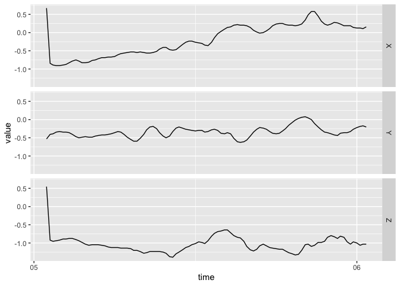

<!-- README.md is generated from README.Rmd. Please edit that file -->

# bis620.2022

<!-- badges: start -->

[](https://app.codecov.io/gh/annieliyi/bis620.2022?branch=main)
[](https://github.com/annieliyi/bis620.2022/actions/workflows/R-CMD-check.yaml)
[](https://github.com/annieliyi/bis620.2022/actions/workflows/test-coverage.yaml)
[](https://github.com/annieliyi/bis620.2022/actions/workflows/lint.yaml)
<!-- badges: end -->

The goal of bis620.2022 is to

1)  compute spectral signature of accelerometry data recorded in three
    dimensions via Fast Fourier Transformation (FFT) and conduct the
    frequency of time.

2)  plot accelerometry data recorded in three dimensions with a time for
    frequency column.

## Installation

You can install the development version of bis620.2022 from
[GitHub](https://github.com/) with:

``` r
# install.packages("devtools")
devtools::install_github("annieliyi/bis620.2022")
```

## Example

This is a basic example which shows you how to solve a common problem:

``` r
library(bis620.2022)
## basic example code
data(ukb_accel)
##compute spectral signature of the first 100 rows of ukb_accel and conduct frequency from time
ukb_accel[1:100, ] |>
      spectral_signature()
#> # A tibble: 50 × 4
#>         X     Y       Z  freq
#>     <dbl> <dbl>   <dbl> <dbl>
#>  1 19.8   33.7  103.     1.01
#>  2 26.0    4.23   4.18   1.03
#>  3  8.14   4.23   9.58   1.05
#>  4  7.50   3.91   4.86   1.08
#>  5  1.55   2.74   2.73   1.10
#>  6  4.32   2.09   0.820  1.12
#>  7  2.61   2.62   2.85   1.15
#>  8  3.87   2.88   2.55   1.18
#>  9  3.63   2.90   0.237  1.20
#> 10  0.862  2.60   2.82   1.23
#> # … with 40 more rows

##plot the first 100 rows of ukb_accel to illustrate the movement of object against time
ukb_accel[1:100, ] |>
      accel_plot()
```



``` r
##plot the spectural signature of the first 100 rows of ukb_accel taking logarithm against frequency
ukb_accel[1:100, ] |>
      spectral_signature(take_log = TRUE) |>
      accel_plot()
```


